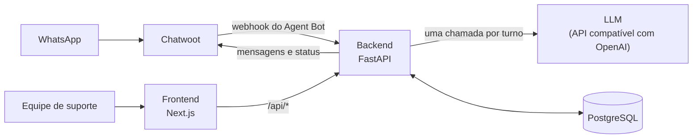

## Cauê Franco

**AI Full Stack Engineer.** Construo agentes de LLM e o produto inteiro em volta deles: back-end, interface, integrações e deploy.

Na **GeniAI** trabalho onde a IA encosta na operação real: agentes que atendem no WhatsApp pelo Chatwoot, identificam quem está falando, respondem só com a base de conhecimento aprovada e passam para um humano quando não sabem. Em volta do modelo vai o que faz isso aguentar produção: regras de transbordo, avaliação de modelos, filas e outbox para as chamadas externas, painel para a equipe, testes e deploy.

Não entrego só features. Construo sistemas observáveis e fáceis de manter, e conecto cada decisão técnica a um resultado de negócio.

📍 João Pessoa - PB · Análise e Desenvolvimento de Sistemas

---

### Como eu construo com LLM

- **O modelo interpreta, o código decide.** O LLM lê a mensagem e devolve um JSON validado por schema; o fluxo, as transições e tudo o que tem efeito colateral ficam em código testável. A saída do modelo não tem campo de ação.
- **Grounding antes de criatividade.** O agente responde só com o que está na base aprovada. O que não está lá vai para uma pessoa, com o contexto já resumido.
- **Falha previsível.** Pedido de atendente humano é detectado também por regra em código, então funciona mesmo com o LLM fora do ar. Se o modelo estoura o tempo ou devolve algo inválido, ganha uma nova tentativa; na segunda falha o ticket vai para a equipe e o cliente é avisado.
- **Eval antes de trocar de modelo.** Um conjunto de casos roda contra cada modelo candidato e mede acerto e latência antes de qualquer troca.

---

### Projetos

#### Agente de suporte no WhatsApp `código aberto`

[**chatbot-atendimento-geniai**](https://github.com/cauedev30/chatbot-atendimento-geniai)

Mesa de suporte da GeniAI: um agente LLM que roda como bot do Chatwoot, um kanban para a equipe e uma página de indicadores.

**O que o agente faz.** Identifica o atendente da unidade pelo telefone e abre o ticket na hora. Tenta uma resposta do FAQ, enviada exatamente como a equipe escreveu, e responde até três dúvidas sobre ela usando só a base de conhecimento daquele item. Pergunta fora da base, quarta pergunta ou pedido de atendente vão para uma pessoa, com o resumo no ticket. Junta rajadas de mensagens curtas num turno só, lê imagens e transcreve áudios, que passam a valer como texto em todas as regras.

**Engenharia em volta do modelo.**

- Uma chamada de LLM por turno, com prompt e schema de saída versionados, validação Pydantic e uma nova tentativa.
- Fila por conversa para manter a ordem das mensagens, e outbox no banco para as chamadas ao Chatwoot, com retry.
- Arquitetura em camadas: regras puras em `domain/` sem I/O, casos de uso em `app/` dependendo de portas (LLM, Chatwoot, transcrição), adaptadores trocáveis. Os testes trocam as portas por fakes.
- Provedor de LLM e de transcrição plugável por qualquer API compatível com OpenAI.
- Eval próprio: casos fictícios rodam contra cada modelo candidato e medem detecção de pedido humano (o gate exige 100%), acerto de categoria e de FAQ, perguntas de esclarecimento, leitura de imagem e latência p50/p95.
- Sincronização nos dois sentidos com o Chatwoot: fechar o card resolve a conversa, e resolver a conversa fecha o card.
- Indicadores por período e unidade: volume, taxa de resolução pelo bot, mapa de calor unidade × categoria, tempos de espera e saúde do FAQ.

**Stack:** Python 3.12 · FastAPI · Pydantic · SQLAlchemy Core + asyncpg · PostgreSQL · React · Next.js · TypeScript · Pytest · Playwright

#### Automação de provisionamento no Chatwoot `código fechado`

**O problema.** Cada atendente novo numa unidade exigia criar à mão cinco artefatos encadeados no Chatwoot: usuário, time pessoal, regra de automação, label e vínculo de inbox. Repetido a cada contratação, em dezenas de contas. Lento, sujeito a erro e sem rastro de quem mudou o quê.

**O que construí.** Workflows n8n que fazem o provisionamento de ponta a ponta pela API do Chatwoot, com o Supabase como cadastro. O fluxo é idempotente e registra cada execução. Antes de escrever qualquer coisa, o cadastro no banco e o estado real no Chatwoot precisam concordar; se divergem, a execução para em vez de gravar pela metade. A remoção segue o caminho inverso, com a ordem das exclusões pensada para não deixar nada órfão.

**Uma automação, não vinte.** Roda em **cerca de 20 contas** de uma rede de franquias de saúde. Cada conta tem convenção própria de nomes, times e regras, e generalizar isso sem duplicar lógica foi o trabalho de engenharia real do projeto.

**Stack:** n8n · Python · API REST do Chatwoot · PostgreSQL/Supabase

#### Loja com catálogo gerenciado no edge `código fechado` `freelance`

**O problema.** Uma loja de moda praia precisava de um catálogo online que a própria dona conseguisse manter, sem depender de desenvolvedor a cada produto novo ou tamanho esgotado.

**O que construí.** Site em Next.js exportado como estático e servido por um Cloudflare Worker. A dona da loja tem um painel próprio, atrás de senha, para cadastrar produto, marcar tamanho esgotado e publicar sozinha. O pedido sai da sacola direto para o WhatsApp, já com os dados do cliente. Deploy automático pelo GitHub Actions a cada push. Tudo o que muda de um cliente para outro fica num único arquivo de configuração, então o projeto serve de base para outras lojas.

**Stack:** Next.js · TypeScript · Cloudflare Workers · Cloudflare D1 · GitHub Actions

#### Plataforma de governança de contratos `código fechado` `produto interno`

**O que é.** Sistema de gestão de contratos de aluguel: cadastro, carteira, reajustes, anexos e extração automática dos dados do contrato via LLM. Produto interno, sem cliente externo ainda.

**O que fiz.** Features entregues por TDD sobre uma base Next.js/Supabase com isolamento por RLS e arquitetura em camadas, com o domínio separado da camada de dados e da apresentação.

**O achado que mais importa.** Numa auditoria do próprio código encontrei uma falha de autorização: uma rota de download usava o cliente administrativo do banco, que ignora RLS, e só verificava se o usuário estava logado, nunca se o documento era dele. Trocar um identificador na URL entregava o contrato de outra pessoa. Corrigi e escrevi quatro testes de regressão para a falha.

**Stack:** Next.js · TypeScript · Supabase/PostgreSQL com RLS · Vitest

---

### Engenharia assistida por IA

Desenvolvo com workflow agêntico como método, não como atalho:

- **Claude Code com skills e hooks por projeto.** Receita que se repete vira skill; regra que dá para checar por comando vira hook, em vez de ficar só como instrução.
- **Workspace com contexto versionado.** Cada projeto tem estado atual, decisões e specs em arquivo, para o agente partir do projeto real e não de suposição.
- **MCP servers** para dar ao agente as ferramentas do projeto, como o painel de deploy.
- **Critério de aceite executável.** Toda feature nasce com um comando que prova que funciona e só fecha quando ele roda verde.
- **Aprovação humana antes de qualquer ação irreversível:** push, deploy, exclusão.

---

### Stack

**IA aplicada:** LLMs · RAG · embeddings e bancos vetoriais · agentes e sistemas multiagente · function calling · MCP · prompt e context engineering · evals e controle de custo de tokens · transcrição de áudio · n8n

**Back-end e full stack:** Python · FastAPI · SQLAlchemy · TypeScript · Node.js · React · Next.js · PostgreSQL (Supabase, RLS) · APIs REST e webhooks · Clean Architecture · Docker · Dokku · Cloudflare Workers · CI/CD com GitHub Actions · Pytest · Vitest · Playwright

---

### Código aberto

| Projeto | Sobre |
|---|---|
| [chatbot-atendimento-geniai](https://github.com/cauedev30/chatbot-atendimento-geniai) | Agente de suporte no WhatsApp com kanban e indicadores, em Python/FastAPI e Next.js |
| [Projeto-FullStack-ReNTAI](https://github.com/cauedev30/Projeto-FullStack-ReNTAI) | Teleconsultoria fullstack em TypeScript, com validação de documentos, notificação em tempo real e E2E com Playwright |
| [Gerenciador-de-estoque-padaria](https://github.com/cauedev30/Gerenciador-de-estoque-padaria) | Gerenciador de estoque em Python |
| [projeto-movie-manager](https://github.com/cauedev30/projeto-movie-manager) | Catálogo de filmes em JavaScript |
| [portfolio-caue-franco](https://github.com/cauedev30/portfolio-caue-franco) | Portfólio pessoal, [no ar](https://cauedev30.github.io/portfolio-caue-franco/) |

---

### Contato

[LinkedIn](https://www.linkedin.com/in/cauefranco01/) · cauefranco01@gmail.com · [Portfólio](https://cauedev30.github.io/portfolio-caue-franco/)
